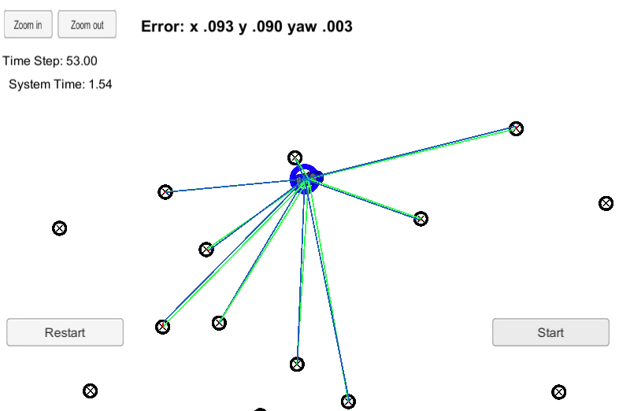
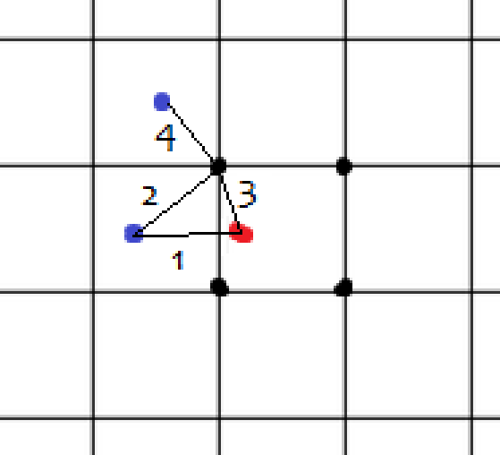

# Particle Filter

In this project, I implemented a __Particle Filter__ in C++.

My submission includes the following files:
- __main.cpp__: The main file that I also updated a little in order to speed up the computation.
- __particle_filter.cpp__: In this file, you can find all necessary parts of the particle filter, including its initialization, the prediction step, the weights update, and the resampling wheel.
- __particle_filter.h__: The corresponding header file.

## Project Specifications

My particle filter fulfills the necessary conditions on accuracy and performance.

## Discussion

I found that around 100 particles are enough to obtain the necessary accuracy and performance.

One time consuming step in the weight update is to find the closest landmark of each (transformed) observation. I speeded this up with some preprocessing in the initialization step, computing some structure similar to a Voronoi diagram. Then, I could obatin the closest landmark with about four comparisons.

This was done as follows:
First, I constructed a grid with 1x1 cells. If we need to know the closest landmark of some observation in such a grid, it (almost) suffices to consider the closest landmarks of the four corner points:

Let the red dot be the observation and the blue dots be landmarks. Then, we want to find out the length of line 1. From our preprocessing, we have the length of line 4. The length of line 2 is smaller than the sum of lines 3 and 1, where line 3 is at most sqrt(2) by the choice of the grid (l2 < l3 + l1). Also, the length of line 1 is smaller than the sum of lines 3 and 4 (l1 < l3 + l4).

Together, we obtain: $l2 < 2 \cdot l3 + l4 < 2 \cdot \sqrt{2} + l4.$

Thus, if we change our preprocessing a little bit such that we associate with every grid point not only the closest landmark with distance d but also all landmarks within distance 2 * sqrt(2) + d, we are good to go! 
